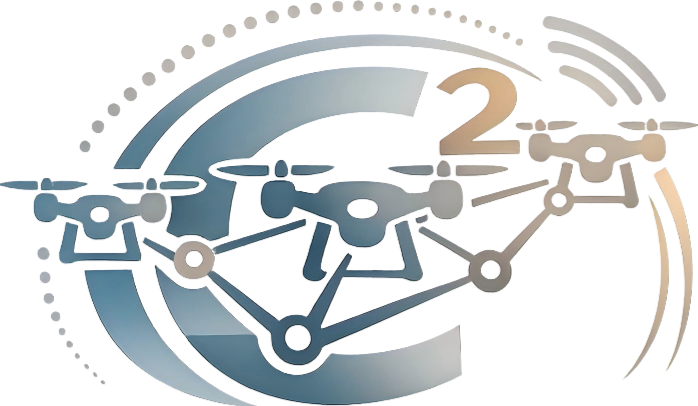
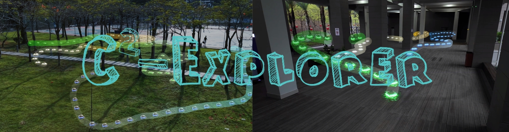

<div align="center">
  <h1>
     C<sup>2</sup>-Explorer

  </h1>
  <h2>Contiguity-Driven Task Allocation with Connectivity-Aware Task Representation for Decentralized Multi-UAV Exploration</h2>
  <!-- <strong>
    Research Project / Preprint
  </strong> -->
  <!-- <br> -->
  <p align="center">
    Xinlu Yan<sup>1,*</sup>,
    <a href="https://zager-zhang.github.io" target="_blank">Mingjie Zhang</a><sup>2,3,*</sup>,
    Yuhao Fang<sup>1</sup>,
    Yanke Sun<sup>1</sup>,
    <a href="https://personal.hkust-gz.edu.cn/junma/people-page.html" target="_blank">Jun Ma</a><sup>2</sup>,
    <a href="https://homepage.hit.edu.cn/youmingong" target="_blank">Youmin Gong</a><sup>1</sup>,
    <a href="https://robotics-star.com/people" target="_blank">Boyu Zhou</a><sup>3,†</sup>,
    <a href="https://homepage.hit.edu.cn/meijie" target="_blank">Jie Mei</a><sup>1,†</sup><br/><sub>&nbsp;</sub><br/>
    <sup>1</sup> Harbin Institute of Technology, Shenzhen<br/>
    <sup>2</sup> The Hong Kong University of Science and Technology (Guangzhou)<br/>
    <sup>3</sup> Southern University of Science and Technology<br/>
    <sup>*</sup> Equal Contribution &nbsp;&nbsp; <sup>†</sup> Co-corresponding Authors
  </p>
  <a href="https://arxiv.org/abs/2603.07699" target="_blank"></a>
  <a href="https://www.bilibili.com/video/BV1U5N3zgE4p/?share_source=copy_web&amp;vd_source=1801a551da967e1db6162c2de1380d70" target="_blank"></a>
  <a href="https://robotics-star.com/C2-Explorer/" target="_blank"></a>
  <br/>
  <p><em>Code will be released upon acceptance.</em></p>
</div>

<p align="center">
  
</p>

<p align="center">
  C<sup>2</sup>-Explorer is a <strong><em>decentralized</em></strong> multi-UAV exploration framework to enhance <strong><em>flexible</em></strong> and <strong><em>contiguous</em></strong> task allocation.
</p>

## Motivations and Contributions

<p align="center">
  
</p>

## Real-World Experiments

<p align="center">
  
</p>

## Benchmark Comparisons

<p align="center">
  
</p>

## Citation 📜

```bibtex
@misc{yan2026c2explorer,
      title={C$^2$-Explorer: Contiguity-Driven Task Allocation with Connectivity-Aware Task Representation for Decentralized Multi-UAV Exploration}, 
      author={Xinlu Yan and Mingjie Zhang and Yuhao Fang and Yanke Sun and Jun Ma and Youmin Gong and Boyu Zhou and Jie Mei},
      year={2026},
      eprint={2603.07699},
      archivePrefix={arXiv},
      primaryClass={cs.RO},
      url={https://arxiv.org/abs/2603.07699}, 
}
```
